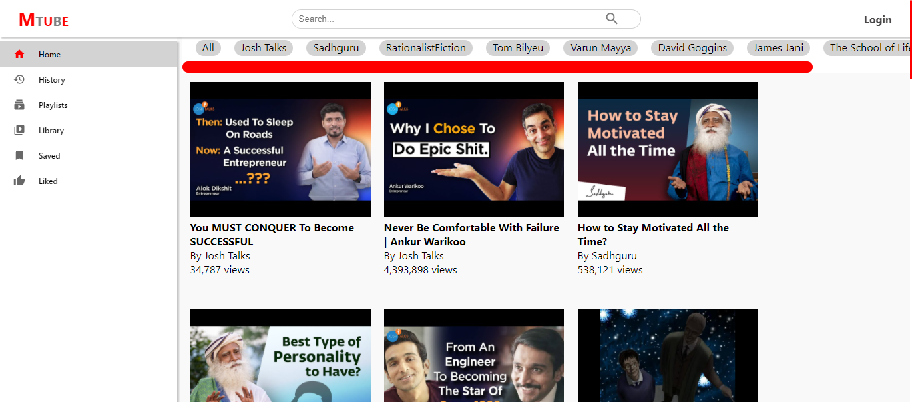

# MoonTube

A Video Library App built with React ⚛

### Preview
Deployed app: [https://moontube.netlify.app/](https://moontube.netlify.app/)
#Home Page


    


Backend source code (Express & Mongoose): [https://github.com/KuldeepSinghRathore/MoonTube](https://github.com/KuldeepSinghRathore/MoonTube)

### Features:
1. Local storage persistence of auth state
2. Auth: Log in and Sign up auto logout on token expiry
3. Private and public routes: Private routes accessible only on login
4. User actions like add/remove from playlist, liked,saved etc.
5. Video page for each video
6. Filter Video based on Category Or Creator
7. Search Functionality On Video Page
8. Add Or Remove to saved , history,playlist on Video Page

9. Responsive design for mobile and desktop
10. React: useContext, useReducer, useEffect, useState,axios interceptors, functional components


Bootstrapped with `create-react-app`

## Run Locally

#### Get started

1. **Clone the repo:**
```bash
  $ git clone https://github.com/KuldeepSinghRathore/video-library-fe.git
```
2. **Install required node modules:**
```bash
  $ npm install
```
3. **Start the dev server:**
```bash
  $ npm start
```
Open the `localhost` link in the browser.
Happy hacking!       

## 🔗 Links
[](https://twitter.com/__Kuldeep_Singh)

[](https://www.linkedin.com/in/kuldeep--singh/)
